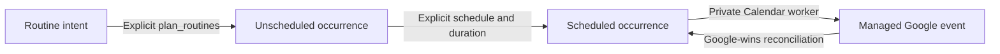
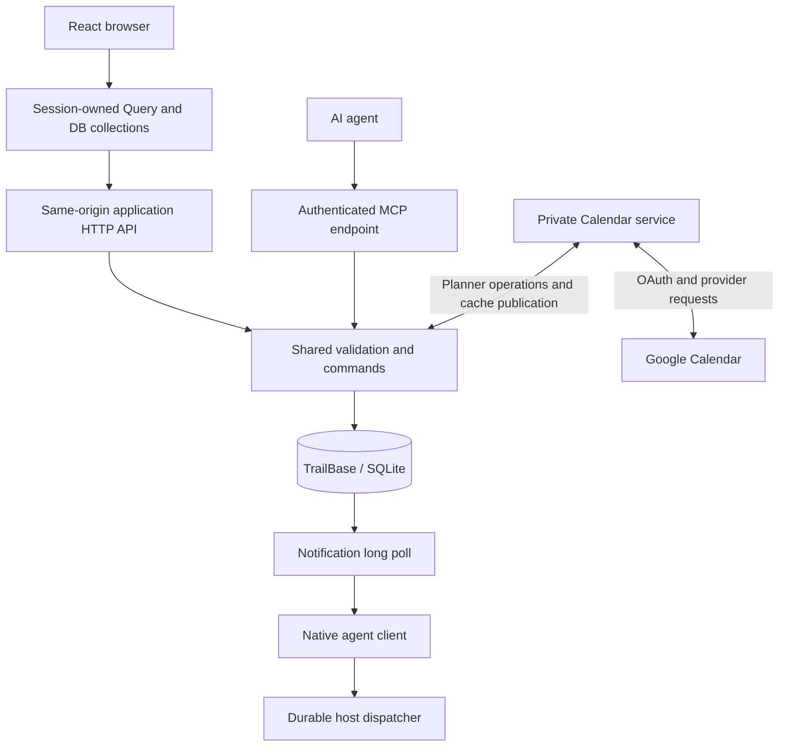

# MeOS

MeOS is a mobile-first personal planner for tasks, projects, routines, and daily
and weekly plans, shared by you and your AI assistant.

- **USER:** [Quickstart](#user-quickstart) — set up a persistent planner for your
  real days. [More user information](#user-guide) covers your
  first plan, assistant cadence, verification, and daily use.
- **CONTRIBUTOR:** [Quickstart](#contributor-quickstart) — run the local demo to
  explore or change the code. [More contributor information](#contributor-guide)
  covers the planning model, architecture, codebase, and deployment boundaries.

## Purpose and design goals

A task list records what you could do. MeOS helps turn that intent into a
realistic day or week, then revise the plan as circumstances change. You can
work in the browser; an agent can help through MCP. Both use the same validated
application commands and planning records rather than maintaining separate plans.

The design keeps a few distinctions explicit:

- **Intent is not a schedule.** Tasks and routines can exist without assigned
  times. Planning creates routine instances; scheduling gives them concrete slots.
- **Your commitments constrain the plan.** Google Calendar can supply external
  context and synchronize MeOS-owned blocks. Imported commitments remain
  read-only; missing Calendar context means unknown availability, not a free day.
- **Assistance has boundaries.** You choose what the agent may change and when
  it may contact you. A working app does not by itself provide proactive help.
- **Saved, synchronized, and delivered are different outcomes.** Persistent
  installations store planning records in TrailBase/SQLite; a separate private
  service handles Calendar, and the agent host handles scheduled work and delivery.
  Each selected capability needs its own verification.

## USER quickstart

Start with your real days. Reuse a verified persistent instance if you have one;
otherwise work with your agent or operator through [personal setup](#personal-setup)
and the [bootstrap procedure](public/skills/meos-bootstrap/SKILL.md).

**Current installation limit:** self-hosting on a new host requires engineering
work; this repository does not yet ship a portable production installer. The
shipped path is Linux/systemd with a Docker native runtime and protected web
adapter. Its helpers have owner-specific assumptions and need reviewed
configuration support for another host. Do not copy another owner's identity or
disable trust checks to make installation pass. The in-memory demo and root
Compose preview are contributor fixtures, not a personal installation.

You can give your agent this starting request:

> Help me use MeOS for my real days. First check whether I have a verified
> persistent instance and what your host can actually do. Guide me through the
> choices below, recommend a small first-day plan, and tell me what is verified
> or blocked. Do not count a temporary demo as completed personal setup.

## USER guide

### Personal setup

You do not need to design the infrastructure or inventory your whole life first.
Work through these decisions with your agent or operator. Reuse known preferences;
record missing answers, explicit deferrals, and verified results in the bootstrap
procedure's [existing completion checklist](public/skills/meos-bootstrap/SKILL.md#keep-one-completion-checklist),
not a second setup ledger.

1. **Choose access and hosting.** Confirm the data owner, local timezone, intended
   devices, and private or public access. Should it work from your phone and keep
   running when your laptop is off? Have the operator inspect the actual host and
   explain supported options and maintenance needs. Reuse a verified instance;
   for a new one, resolve the [installation prerequisites and gaps](public/skills/meos-bootstrap/SKILL.md#installation-target)
   before claiming setup is available.
2. **Choose Calendar and planning authority.** If connecting Google Calendar,
   use secure browser consent for the intended account, choose the calendars used
   as context and the dedicated MeOS planning calendar, and verify read/sync status.
   Never paste credentials into chat. Explicitly choose proposal-only planning or
   permission to manage MeOS-owned blocks within your constraints; imported
   commitments stay protected. If Calendar is deferred, state that its context
   and synchronization are unverified and use a proposal based on known commitments.
   See the [authority procedure](public/skills/meos-bootstrap/SKILL.md#configure-per-install-planning-authority).
3. **Choose cadence and contact.** A starter rhythm could be morning launch,
   evening preparation, and weekly review, adjusted to your waking and working
   hours. Choose a delivery destination, quiet hours, and whether advance, start,
   or end-of-event messages are useful. These choices do not grant planning
   authority. The host must support durable schedules, execution, and proactive
   delivery; otherwise use honest on-demand assistance. The
   [agent setup procedure](public/skills/meos-bootstrap/SKILL.md#stage-4--configure-the-operating-agent)
   covers capability discovery, missed runs, and selected jobs.

### Make a useful first plan

Ask: **“Would you like to talk about today, tomorrow, this week, or next week?”**
Use the selected horizon to load the relevant planning procedure, not every skill:

| Horizon | Procedure |
| --- | --- |
| Today | [Morning launch](public/skills/meos-morning-launch/SKILL.md), or [Rescue the day](public/skills/meos-rescue-day/SKILL.md) when a plan needs repair |
| Tomorrow | [Evening close + tomorrow prep](public/skills/meos-evening-close/SKILL.md), focusing on tomorrow rather than inventing today's actuals |
| This week | [Weekly review](public/skills/meos-weekly-review/SKILL.md), focused on the current week |
| Next week | [Weekly review + 14-day look-ahead](public/skills/meos-weekly-review/SKILL.md), focused on next week |

Bring one to three current outcomes, essential routines, fixed commitments, work
windows, and room for interruptions. Ask the agent for a rough day or week and a
concrete next action. Refine that small proposal before entering a large backlog.

With planning authority, place a small real block and verify its saved schedule
and, if selected, its Calendar result. Without that authority, keep the result a
proposal—no Calendar writes are needed to see whether the plan is useful. A routine
template is intent, not proof that an occurrence or event has been scheduled.

### Verify the first day

Before calling setup complete, check the capabilities you selected:

- **Persistent planner:** the correct owner can sign in from the intended device,
  and real planning data survives an operator-controlled restart.
- **Agent access:** the actual agent can discover its tools and read your planner.
  If scheduled work is selected, verify access in that execution context too.
- **Calendar:** the intended context is available and fresh; an authorized real
  planning change reaches the chosen MeOS calendar. A saved app record alone is
  not synchronization proof.
- **Proactive assistance:** selected jobs are registered and an execution is
  verified; the chosen message route works. Verify event handoff separately when
  event messages are selected. Do not send test messages or make synthetic
  Calendar writes without test authority.

Finish with a clear next action, when and where the next check-in will happen,
what the agent may change, how to pause its jobs through the host, and any exact
blocker or unverified feature. A registered job is configured, not proven. Keep
manual mode explicit when the host cannot provide proactive assistance.

### Continue using MeOS

Use ordinary requests such as “help me plan today,” “prepare tomorrow,” or “this
day has gone off track.” The agent needs both its MCP connection and installed
operating procedures; a published skill file does not install itself.

- [Assistant entry point](public/skills/meos-assistant/SKILL.md): daily triage,
  priorities, and next actions in ordinary chat.
- [Operating procedures](llms.txt): morning, evening, weekly review, event support,
  and recovery when plans change.
- [Shared operating contract](public/skills/contract.md): protected commitments,
  authority, evidence-aware actuals, and delivery rules.
- [Bootstrap and maintenance](public/skills/meos-bootstrap/SKILL.md): finish partial
  setup, enable selected features, inspect, repair, update, or pause without
  resetting working state.

Use the first day and week to tune cadence and estimates. Do not inherit another
person's schedule, quiet hours, or grants of autonomy.

## CONTRIBUTOR quickstart

This path is for contributors and coding agents familiar with JavaScript or
TypeScript. It describes the checked-out source, not a live installation. Start
with the demo below, then use the [contributor guide](docs/CONTRIBUTING.md) to
trace a change and choose focused checks. No persistent setup is required for
sample-data UI work.

### Run the local demo

Use **Node.js 24** and **pnpm 10.30.3**, as configured in
[package.json](package.json) and [CI](.github/workflows/check.yml). Run from the
repository root in a development environment without production credentials.

```sh
pnpm install --frozen-lockfile
pnpm dev
```

Open the loopback URL printed by Vite. The checked-in
[public/config.js](public/config.js) selects `demo: true`. MSW intercepts API
requests and keeps sample records in page memory. Try completing a task and
navigating between Today and Week: the change survives navigation. Reload the
page: the sample data resets. Each tab has independent data. Stop Vite with
Ctrl-C when finished.

This is a UI development path, not a persistent local installation. It does not
connect Google Calendar or exercise native authentication. Do not set
`demo: false` and expect a backend to appear; real mode needs the protected API
and configured native runtime. Public runtime configuration must contain no
credentials.

For a static build and the baseline browser journey:

```sh
pnpm contract:check
pnpm licenses
pnpm typecheck
pnpm build
node scripts/serve.mjs
```

Leave that loopback-only server running, then in a second terminal run:

```sh
pnpm test:browser
```

The journey uses `http://127.0.0.1:3181` and a local Chromium executable at
`/usr/bin/chromium-browser`. Set `PREVIEW_URL` or `CHROMIUM_PATH` if your fixture
uses different values. Success prints `PASS A` and writes a screenshot under
`artifacts/`. Stop the static server with Ctrl-C. This baseline covers demo
behavior; use the [verification map](docs/CONTRIBUTING.md#choose-verification)
for real-mode fixtures and backend changes.

## CONTRIBUTOR guide

Read the model before changing planning behavior; use the codebase map and
linked contracts for direct lookup.

### Planning model

The central distinction is **intent versus assignment**. A routine says what
should recur. An occurrence records one instance. A schedule assigns a concrete
time; reading the planner does not make that decision.

| Record | Meaning | Consequence |
| --- | --- | --- |
| Task | A unit of work, optionally linked to a project and a schedule | Unscheduled means no assigned instant, not midnight |
| Project | A grouping of tasks with its own notes and optional target date | Archiving a project unassigns its tasks in one transaction |
| Routine | Recurrence, duration, and preferred-time intent in a timezone | Saving a template does not create occurrences or Calendar events |
| Occurrence | A routine instance linked by `routineId`, with snapshot content and completion | Moving it preserves its ID and original recurrence `date`; template edits do not rewrite it |
| Weekly outcome | A task-linked commitment for an inclusive week period | It is separate from task priority and scheduled time |
| Period note | Notes for an inclusive day or week period | It records reflection or context, not an executable schedule |

A commute is a task with `type: "commute"`. It stays in the agenda and any linked
project but is excluded from **No project**. Routine occurrences are their own
records, not unassigned tasks; their editor links back to the routine.

#### From routine to calendar

**Figure 1. Planning creates instances; scheduling assigns time; synchronization publishes it.**



For example, a daily walk routine can express a minimum duration and a preferred
time without fixing every day's clock time. Explicit planning materializes
missing fixed-recurrence slots within a bounded window: today through at most
14 days ahead in the routine's timezone. New instances are unscheduled; existing
slots retain their identity and state. Flexible frequency targets and unresolved
recurrence need deliberate planning rather than arbitrary expansion.

The person or agent then chooses a schedule and concrete duration. The backend
validates revisions and assignments; it is not an AI scheduling optimizer.
`preview_schedule` checks assignments without writing; `apply_schedule` commits
the assignment batch and retry receipt atomically. Calendar publication happens
later. A saved schedule is not proof that Google has received it.

Schedules use a local date, clock time, and IANA timezone. Nonexistent daylight
saving times are rejected; ambiguous times require a matching offset. Displaying
an item in another timezone does not change its original routine slot.

### Architecture

**Figure 2. Browser and agent commands meet at the application layer; provider credentials stay outside the browser.**



The browser uses React, TanStack Start in SPA mode, Router, Query, and DB
collections. Base UI and StyleX provide interface primitives and styling;
ProseMirror provides notes. The protected layout establishes the session before
private reads. Collections share the Query cache; session changes cancel reads
and dispose the previous owner's data. Private entity data and credentials are
not persisted in browser storage.

The production application runs authored JavaScript as a compiled WASI component
inside TrailBase. HTTP and MCP adapters call the same command layer, backed by
SQLite transactions. Runtime-authenticated identity determines the owner;
request JSON cannot choose one. A separate Node web entry point handles the
protected browser boundary and private service routing.

The Calendar service owns OAuth credentials, provider polling, and managed-event
reconciliation. It publishes a credential-free, owner-scoped cache into the main
database for browser and agent reads. Primary Calendar events are read-only
context. Managed events use Google-wins conflict handling. An unavailable cache
means unknown availability, not a free day.

Optional notifications deliver work to an agent client and durable dispatcher.
Delivery is at least once: acknowledgment means durable handoff, not completion
of the agent's task. Keyword search needs no embedding provider; semantic search
requires an explicitly enabled external producer. Neither an embedding worker
nor an agent schedule starts merely because these files exist.

### Codebase map

| Path | Responsibility |
| --- | --- |
| [src/routes/](src/routes/) | Protected layout and Today, Week, Settings route composition |
| [src/components/](src/components/) | Planner, resource and occurrence editors, Calendar UI, session gate |
| [src/lib/loading.ts](src/lib/loading.ts), [store.ts](src/lib/store.ts) | Session bootstrap, route preloads, revision refresh, shared Query/DB collections |
| [src/lib/backend/](src/lib/backend/) | Browser transport, session fencing, codecs, real repository adapter, generated client |
| [src/lib/mock.ts](src/lib/mock.ts) | MSW demo data and request handling—not persistent storage |
| [backend/contract.mjs](backend/contract.mjs) | Canonical operation metadata and JSON Schemas used by validation, MCP, and generation |
| [backend/commands.mjs](backend/commands.mjs), [domain.mjs](backend/domain.mjs), [scheduling.mjs](backend/scheduling.mjs) | Transactions, ownership, semantic validation, recurrence and time rules |
| [backend/guest/](backend/guest/), [trailbase-port.mjs](backend/trailbase-port.mjs) | WASI entry point and native database/runtime binding |
| [backend/migrations/](backend/migrations/) | Ordered SQL schema and data migrations |
| [backend/calendar-service.mjs](backend/calendar-service.mjs) and `backend/calendar-*.mjs` | Private provider lifecycle, snapshots, reconciliation, and main-database cache |
| [backend/search.mjs](backend/search.mjs), [notifications.mjs](backend/notifications.mjs) | Derived search indexes and durable notification protocol |
| [clients/](clients/) | Native Go long-poll client and Python host/MCP/dispatch adapters |
| [public/skills/](public/skills/), [llms.txt](llms.txt) | Agent operating procedures and discovery index |
| [scripts/](scripts/), [.github/workflows/](.github/workflows/) | Generation, focused checks, isolated qualification, and release tooling |
| [deployment/](deployment/), [tools/backup/](tools/backup/) | Native service templates and optional recovery tooling |

### Agent entry points

There are two different reading paths for agents:

- **Coding agents:** read this README and the [contributor guide](docs/CONTRIBUTING.md).
  Follow the relevant source path, change canonical contracts before generated
  output, and report exactly what was verified.
- **Planning agents:** begin with [llms.txt](llms.txt) and the
  [shared operating contract](public/skills/contract.md). Discover the installed
  MCP tools and their schemas rather than assuming every operation is available.
  Use the [host MCP guide](public/skills/meos-bootstrap/host-mcp.md) for transport
  setup, not direct database access.

The native MCP endpoint is `/api/meos/v1/mcp`. Its authenticated grant determines
owner and scopes; browser cookies are not MCP credentials. Agents operate
through application tools, not arbitrary SQL or network-fetch tools. Keep the
same idempotency key and payload when retrying an uncertain mutation; reread
current records before resolving a revision conflict.

Operating procedures are served from `public/skills/` at `/skills/`; the deployed
index comes from [public/llms.txt](public/llms.txt). Publishing a skill does not
install a recurring job, authorize a mutation, or activate notifications.

### Deployment boundaries

The root [Dockerfile](Dockerfile), [compose.yml](compose.yml), and
`pnpm preview:deploy` package the **demo** as static nginx content. They are not
the production persistence or Calendar deployment path.

Native releases require a qualified frontend, compiled guest, migrations,
protected web entry point, and the service configuration for enabled features.
The [bootstrap procedure](public/skills/meos-bootstrap/SKILL.md) describes
installation discovery; [release tooling](scripts/release-build.py) and
[service templates](deployment/) show the implementation. Host-specific paths,
admission records, and credentials are not supplied by a fresh clone.

Release status and task-specific qualification evidence belong in PR/CI artifacts
or operator records outside the source tree. Repository topic guides describe
behavior; retained license and machine-readable admission records serve their
specific consumers. See the [documentation lifecycle](docs/CONTRIBUTING.md#keep-documentation-current)
for retention and removal rules.

### Continue

- [Contribute a change](docs/CONTRIBUTING.md): trace behavior, choose checks, and diagnose common failures.
- [Application contract](docs/application-contract.md): operation ownership, retries, and scheduling invariants.
- [Loading and explicit planning](docs/LOADING-ARCHITECTURE.md): session ownership and bounded routine materialization.
- [Calendar cache](docs/calendar-cache.md): freshness, publication, and scheduling context.
- [Search](docs/search.md): keyword retrieval and optional revision-bound embeddings.
- [Native agent client](clients/meos-agent/README.md) and [host integration](clients/meos-host/README.md): durable handoff and recovery.
- [Native runtime boundaries](docs/native-runtime.md): private services, release identity, and rollback.
- [Backup and recovery](docs/BACKUP-RECOVERY.md): optional host-side recovery tooling.

MeOS-authored code is [Apache-2.0](LICENSE). Dependencies and runtime components
have separate notices and reviewed selections; see the
[frontend license review](docs/LICENSE-REVIEW.md) and
[backend license selections](docs/BACKEND-LICENSE-SELECTIONS.md).
